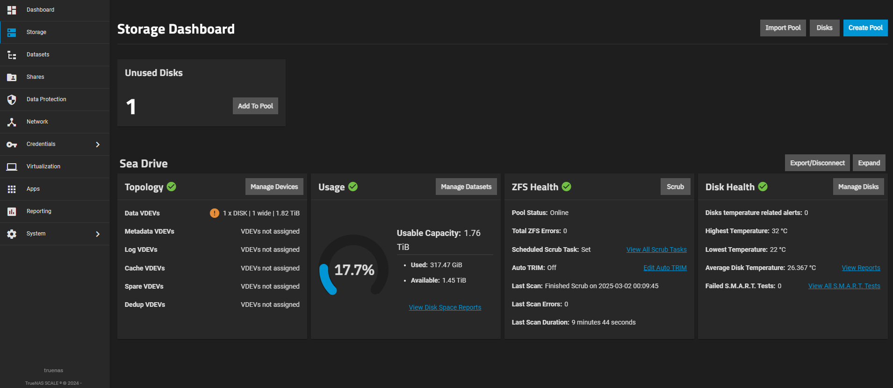

# Preparing App Config Dataset

Based on my deep research of many TrueNAS SCALE setups (1 video) this is how I recommend you prepare your app config.

## Set up your pool

I would assume you already might have setup a storage pool but if you haven't, go to `Storage` in the TrueNAS SCALE web interface, click `Create Pool`, and follow the wizard.

Choose a name (try not to include any spaces), select your disks, and select a data redundancy level (RAIDZ1, RAIDZ2, etc.).  For testing, a single disk or a simple mirror will work.  Don't overthink it too much for this initial setup; the important part is having *a* pool.

All of the other options aren't really necessary for setting up the initial server and can be modified later. Click `Save And Go To Review` and then `Create Pool`.

## Setting up your first dataset

Alright, great job on creating your first pool. Hopefully it's big enough to handle everything you want to build on it for the time being...

Alright,